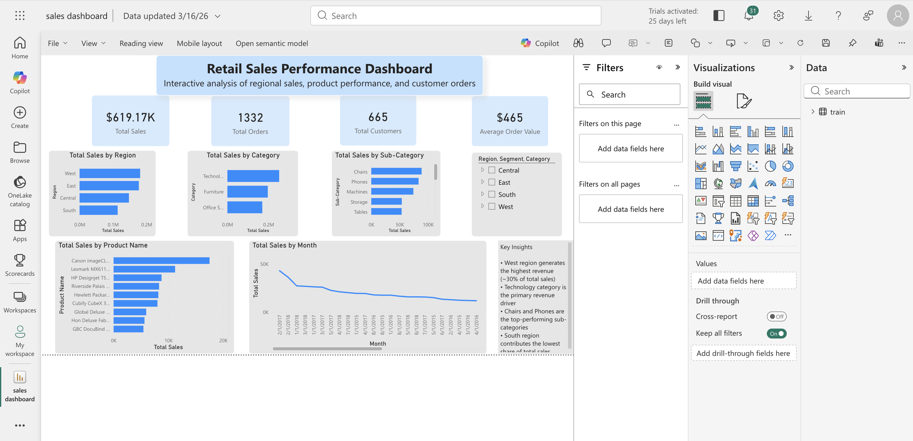

# Retail Sales Performance Dashboard (Power BI)
## Preview

## Overview
Developed an interactive Power BI dashboard to analyze retail sales performance across regions, categories, and customers.

## Key Features
- KPI tracking: Total Sales, Orders, Customers, Avg Order Value
- Regional and category-wise sales analysis
- Monthly sales trends
- Product-level performance insights
- Interactive filtering using slicers

## Key Insights
- West region generates ~30% of total revenue
- Technology category contributes the highest sales
- Chairs and Phones are top-performing sub-categories
- South region has the lowest contribution

## Tools Used
- Power BI
- DAX
- Data Cleaning (Power Query)

